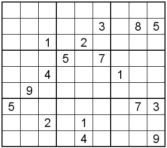

# Backtracking Assignment

In lecture we talked about backtracking, and saw that it *can* provide an improvement over a brute force solution search.  For this project you will put your backtracking skills to use, by creating a program that will solve Sudoku puzzles.

## Sudoku

You are probably aware of Sudoku, the games played on a 9x9 grid using the numbers 1-9.  To complete a puzzle you must add the numbers such that each number 1-9 appears in each row, in each column, and in each segment.

The board looks like this:

The segments are denoted with darker lines around them.



**Note, this is not instance we are going to solve for this assignment.**

## Backtracking

Remember, backtracking follows this general template for our recursive function:

- Are we finished?  Return true.
- Not finished.  See what we can try next.
  - If what we tried is a possibility, accept it and move on.
  - If that leads to a solution return true.
  - If it doesn't, remove the possibility and try something else.
- No more possibilities?  Maybe something went wrong before we got this far.  Return false (backtrack!).

## Assignment

Provide a C++ based Sudoku solver that uses the backtracking method.  Solve the following puzzle:

```C++
int board[9][9] = {{ 0, 3, 0, 0, 0, 0, 0, 2, 0 },
                   { 0, 9, 0, 0, 0, 0, 0, 8, 5 },
                   { 5, 0, 0, 0, 8, 0, 4, 0, 0 },
                   { 4, 0, 7, 2, 0, 6, 8, 9, 0 },
                   { 0, 1, 0, 8, 0, 9, 0, 4, 0 },
                   { 0, 8, 9, 5, 0, 1, 3, 0, 2 },
                   { 0, 0, 3, 0, 1, 0, 0, 0, 9 },
                   { 9, 4, 0, 0, 0, 0, 0, 1, 0 },
                   { 0, 7, 0, 0, 0, 0, 0, 3, 0 }
        };
```

I have given you the puzzle in a multi-dimensional array data structure.  Feel free to use this in your code.
